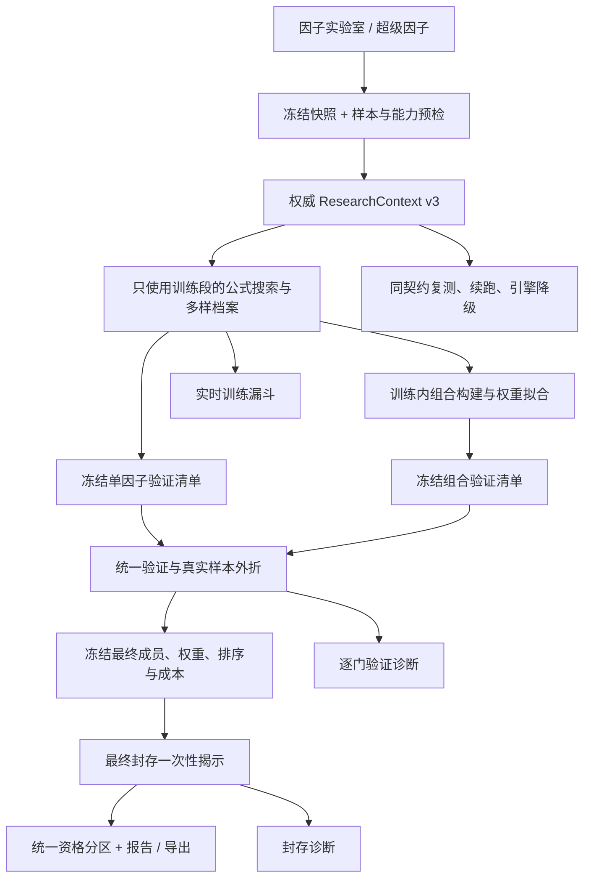

# 因子挖掘、验证与组合优化设计稿

日期：2026-09-30。工作区：`D:\pyobj\AI Trading Desktop`。

文档状态：交付给下一位 AI 的设计稿，尚未实施、尚未通过新版本验收。本轮仅新增设计文档，不修改业务代码、运行任务、配置或数据库。

配套文件：`2026-09-30-factor-mining-reliability-implementation.md`（分阶段实施任务）、`2026-09-30-factor-mining-next-ai-prompt.md`（可直接复制的对接提示词）。

## 1. 目标与成功定义

目标是让系统可靠地搜索、评估和解释因子及组合，消除计算口径导致的误筛，并提供组合层面的搜索能力。

成功必须同时满足：

1. 同一任务的特征、公式、仓位与现金流在训练、验证折、封存、组合、复测之间遵守同一份冻结契约。
2. 两个页面、CPU、WebGPU、原生 GPU 对相同候选使用相同资格标准。训练分、候选数、合格数有明确区别。
3. 新流程支持在训练段选择互补成员并冻结组合，再独立验证整体；不能仅对单因子冠军事后求平均。
4. 正式研究开始前识别不可能通过的样本配置；零合格可以是正常结果，但须可解释、可追溯。
5. 旧公式、旧任务和旧报告可以按原版本回放；结果语义变化不得静默覆盖。
6. 数值正确性、搜索质量和执行效率分开验收。修正年化或放宽过滤导致的数字上涨不算质量提升。

不承诺一定出现合格组合、不承诺未来盈利、不以合格数量单独判断优化成效。

## 2. 已有证据与适用范围

以下是2026-09-30只读排查的证据。实施 AI 应以自己的当前源码与复现结果复核，不把本文当作永远有效的行号或运行状态。

| 编号 | 已确认事实 | 影响与边界 |
|---|---|---|
| E1 | 正常 v2 小时线输出归一化窗口为200；Python `walk_forward_eval_v2`、原生 `walk_forward_eval` 默认250，折内仅取250根历史重算 | Python快照复核证明可改变折收益正负；原生安装版与源码的对应WF文件哈希一致，但没有据此宣称已重放所有真实任务的失败候选 |
| E2 | `.local-data/bench-bars/GATE-BTC_USDT-1h.json` 含4032根小时线；PV_CORR token `[13]` | 连续计算三折Sortino约 `[2.74252, 0.64372, 13.74880]`；当前WF约 `[3.19501, -0.66639, 20.00000]`。第二折被误判为负。该数字只说明计算差异，不能证明该因子满足全部资格门 |
| E3 | `run_mine_portfolio` 仍按 `train_ratio` / `test_recent_bars` 切分，没有完整复用v2计划 | 同4032根数据，v2封存为807根；界面0.7训练比例+增强组合实际评估605根。IC估计截止到组合评估起点，包含验证段 |
| E4 | v2验证和封存各要求至少30自然天；低/中内存档1m默认最多60/120天 | 对应验证/封存仅12/24天；10万/20万根上限也低于150天规则分钟线约216000根。高档182天/30万根没有同样的硬冲突 |
| E5 | 原生流程先筛出独立合格单因子再组合，少于2个返回空；现有组合是等权或正IC加权 | 无真正的成员和权重搜索；可错过仅在组合中提供互补价值的研究成员。这是流程限制，不等于已有某个遗漏组合已被证明能盈利 |
| E6 | CPU/WebGPU严格筛全灭可返回带 `overfit_warning` 的研究候选；原生资格门排除它们 | 旧“冠军数量”与原生“合格数量”不能直接比较 |
| E7 | 当时运行安装程序为0.2.47；当前源码已新增增强加密档案升级修补 | 因子实验室旧入口可能落入legacy：1826根日线、0.7训练、3折、增强切封存后，训练1278/可见1552，独立OOS折为0。旧路径最终代也可能产出封存指标，不能笼统说它始终缺失 |
| E8 | 只读解码到本地保存的ADA/30m原生任务：52583根、500种群、100代、v2档案，保存到第4代时研究10/合格0/拒绝10 | 拒因包含验证和WF失败，未包含OOS折缺失。该任务已经v2，不能归因于E7；摘要不足以逐个重放失败候选，也不能代表100代最终结果 |

额外待核查项：切片首部重置仓位造成重复开仓费用；末尾不完整标签被补零；执行口径与研究口径混用；候选账本是否真正跨代累积；降级后是否继承同一契约。这些在方案中列为验收要求，不冒充已确认导致该ADA任务失败的根因。

## 3. 方案选择与阶段划分

| 方案 | 内容 | 取舍 |
|---|---|---|
| A：推荐 | 第一阶段修复统一契约、评估、资格和诊断；第二阶段增加训练内组合搜索；第三阶段做质量消融与性能优化 | 因果可解释，容易定位改善来自哪一步，可阶段回滚 |
| B：仅修补当前v2几个函数 | 改WF窗口、组合切分和默认区间 | 短期改动小，但历史同名结果语义漂移，组件池和真正组合搜索仍缺失 |
| C：一次性重写搜索及算子库 | 新框架、新评分、新算子、新数据源同时上 | 无法分离错误修正与搜索改良，迁移与对拍成本高，不推荐 |

采用A。保留旧profile；新增 `crypto_local_v3` 承载本设计的修正评估语义。先让v3单因子链路完整，再打开v3组合搜索。旧v2不得因版本升级被原地解释成v3。

阶段交付：

- R1：同一契约、无误筛、正确样本预检、统一资格、实时诊断。组合只保留契约一致的基线评估。
- R2：训练内组合搜索、独立组合资格、最终封存一次性揭示。
- R3：固定快照消融、性能优化、安装包验收。是否默认启用以工程验收为准，质量证据单独报告。

## 4. 总体架构



继续复用现有特征缓存、GPU粗排、原生f64报告、岛模型、变异、去重和有界档案。不要重做已有模块。主机可以做少量标量控制、契约解析、资格分区；原生路径的大数组特征、现金流和指标仍由原生GPU数值所有者计算。

## 5. 冻结的研究契约

### 5.1 唯一解析入口

Python内核负责权威解析与样本计划。TypeScript负责输入、展示、序列化和能力协商，不再各自推导正式切分。两个页面先调用轻量预检，再把返回契约送入所有后端。原生引擎仍必须校验契约，不能信任客户端传入的“通过”值。

`ResearchContextV3`最少包含：

| 字段组 | 必须字段 |
|---|---|
| 版本 | `schema_version`、`profile_id=crypto_local_v3`、`evaluation_contract_id`、`kernel_version`、`feature_semantics_version`、`operator_semantics_version`、`qualification_policy_version` |
| 数据身份 | `snapshot_id`、强内容哈希及算法版本、symbol、venue、market_type、data_channel、timeframe、时区与bar时间语义、关闭bar标识、数据能力/缺口摘要、伙伴数据身份 |
| 归一化 | feature/output各自策略与冻结window、有效性mask规则、连续状态/历史前缀策略 |
| 标签与执行 | label定义、horizon、execution_model、执行延迟、收益归属、有效标签mask、初始状态与终止状态策略 |
| 成本 | 显式fee/slippage/funding规则、1×/2×压力规则、成本来源/估计区间、缺失费用状态 |
| 切分 | train/validation/holdout半开区间、各段时间边界、各段有效计分数量、边界purge、验证折区间、样本不足原因 |
| 搜索预算 | seed、population、generations、复杂度限制、archive容量、候选/组合唯一验证预算、组合政策参数 |
| 复现 | context_hash、run_id、parent_run_id、attempt_id、实际engine及precision、checkpoint模式 |

`context_hash`覆盖所有影响语义的数据和参数；引擎来源另外进入数值缓存键。快照旧FNV id可保留用于索引，但v3内容身份增加SHA-256，明确canonical格式：稳定字段顺序、UTC时间、f64数值、不把null转0、不把额外研究字段排除。可选分块哈希时必须版本化算法，跨端使用同一测试向量。

标签跨度、norm_window、成本或折数变化，都产生新契约和新运行，不能套用旧评分和资格证据。

### 5.2 市场与执行模型

- `signal_research`：连续tanh仓位、收盘研究标签，结果明确标为研究；不被解释成现货做空或实盘成交收益。
- `spot_long_flat`：按真实现货行情和次根开盘执行，多头/空仓；组合后再执行共同仓位状态机。
- `perp_next_open`：按目标永续行情和下一开盘执行，资金费率按结算事件计费。
- market_type未知时可以探索研究，不颁发执行模型资格。不得单凭USDT后缀认定现货/永续。
- 永续funding未知与已知零费率须区分；要求的是覆盖率/事件完整性，不是“必须有一次非零收费”。不完整数据不得静默以零成本通过。
- 手续费默认值保留来源说明；搜索开始前冻结，不根据封存结果调整。新增成本配置必须防止静态cost和fee/slippage重复扣费。
- 国内期货、服务端旧路径保持已有语义；本次先覆盖加密本地三引擎。服务端不支持v3时显示能力限制，绝不静默降到旧profile。

### 5.3 样本预检

先检查时间单调、重复bar、OHLC合法性、正价格、bar闭合、周期一致性、可用字段和关键缺口。不得无提示排序、补假价格、补假funding或补未来数据。

保留目前预注册底线：训练至少500、验证/封存各至少120、验证/封存各至少30自然天、每验证折至少60有效计分点。v3用有效计分数量判定：扣除特征有效前缀、标签边界、缺口mask；训练不能只用总根数满足500。

前端需提前给出预计值，取数后以内核实际预检为准。1m在低/中档无法满足正式研究时：展示“当前设备与区间仅支持探索”；推荐用户主动选择5m/15m或支持更长历史的引擎。保留探索入口，但不能自动改变周期、抬高内存上限或降低30天门槛。

不支持的timeframe明确报错；新周期不能回落成30天默认区间后开始正式搜索。

## 6. 统一计算与评估

### 6.1 权威连续计算原则

v3首次采用“可见历史前缀连续计算后按mask计分”。训练期可见至训练边界；验证期可见至验证边界；最终揭示后可见至封存边界。仅引用历史，不提前把封存输入交给搜索或验证选优。

所有评价使用同一因果特征、公式输出、仓位和现金流；验证折只改变计分mask，不改变归一化窗口、不重新初始化特征、不重置持仓。

概念接口（不要求机械照抄签名）：

```python
evaluate_series(tokens, context, visible_end, series_owner)
score_region(series, context, region, stress_scenario)
evaluate_candidate(tokens, context, stages, series_owner)
evaluate_frozen_portfolio(portfolio_spec, context, stages, series_owner)
```

阶段1以完整可见前缀为正确性基准。历史依赖元数据可用于容量预估，不能未经验证替换成固定warmup。阶段3若做增量状态/窗口裁剪，必须逐bar证明与连续基准一致；EMA类无限历史用可恢复状态，不能谎称固定250根就等价。

### 6.2 有效标签与边界

v3不允许用末尾补零收益加入统计。每个标签记录信号可用时刻、执行时刻、收益起止时刻。

- 训练适应度不能使用跨进验证区的标签。
- 验证折的收益区间须完整落在该折计分范围；验证资格不得引用封存价格。
- `signal_research`、next-open、h根标签各自按实际索引计算purge；不要统一拍脑袋减1根。
- 日历跨度和可交易有效样本同时检查。
- 组合IC及权重训练数据同样遵守标签mask。
- 相邻折边界允许少量purged点，但不得重复计分。

初始仓位只在整个连续序列开头为空仓。折首费用来自连续状态，不重复收开仓费。若产品提供“独立部署从空仓开始”的压力情景，应作为另一种冻结scenario单独报告，不能混进主验证。

平仓成本规则显式冻结：主序列自然延续；最终强平是单独情景或明确终止政策。不得通过忽略最终平仓改善压力测试。

### 6.3 年化与数值异常

加密周期按冻结日历约定年化；不能按每折的异常bar密度重新换年化基础。缺口造成的mask另行报告，不冒充满周期收益。

指标遇NaN/Inf/无有效样本/无下行波动时按声明的指标政策输出原因和状态。禁止把NaN改成0后让资格门通过。极限Sortino截断如保留，须与旧口径分离并披露，不能拿截断值证明数值精度。

资格比较用未round的权威f64原值；round仅用于展示和JSON报告精度。接近0的资格边界使用已冻结的数值政策，不能因引擎不同各设epsilon。

## 7. 搜索、候选档案与验证预算

### 7.1 第一阶段保留的搜索行为

先保持既有适应度、算子/特征ID、零分平台、变异率、岛模型和粗排策略，隔离评估修正的影响。不要同时改评分权重或加入新因子。

复用 `BoundedArchive`，训练指标决定档案保留。快照、tokens、profile、契约、engine/precision进入评分缓存键。验证、封存分数不得进入繁殖、停滞重启、粗排缓存或训练档案。

### 7.2 v3阶段流程

v3默认每代只进行训练评估和训练内稳健性统计。遗传搜索结束后冻结单因子和组合验证清单，再执行一次有预算的验证阶段。避免每代反复做全部严格筛；训练期间“待验证”不计为合格。

已有v2逐代验证保持旧行为用于回放。v3不要求在第4代显示合格单因子；页面显示尚未进入正式验证阶段。

建议首版上限：archive=256；单因子唯一验证候选最多60；训练内组合拟合配置最多24；进入正式验证的组合最多8；最终预注册封存揭示对象最多10个单因子+3个组合。以上为计算与重复试验预算，不是盈利阈值；作为运行前冻结参数，实施消融后再决定默认值。

预算由run级账本累计，按唯一`候选身份+契约+评估阶段`计数。缓存重读不增加唯一试验次数；新表达式/新权重向量增加试验。暂停、崩溃、D-1恢复和引擎降级不能重置账本。

`population×generations`仅是预算近似；分别报告生成次数、唯一表达式、实际f64精算、唯一验证和实际封存揭示次数。PBO代理叫“验证失败率”，DSR是近似多重试验诊断，不是盈利概率。

## 8. 统一资格状态与证据

复用原生资格理念，并把规则移到可被Python和原生元数据控制层共同使用的权威模块；TypeScript仅适配结果。禁止CPU、GPU、native分别推导一套规则。

### 8.1 状态

| 状态 | 含义 | 可单独作为合格单因子 | 可作为组合研究成员 |
|---|---|---|---|
| exploratory | 样本/市场/关键数据不足，仅探索 | 否 | 正式组合同样须完整数据，不借此绕过样本门 |
| train_candidate | 训练可计算、在训练档案中 | 否 | 是，须满足成员可计算/因果/市场约束 |
| validation_passed | 完整验证门通过，尚未揭示封存 | 否 | 是 |
| holdout_pending | 冻结最终清单，封存尚未揭示 | 否 | 是 |
| qualified | 对该对象要求的验证、压力和封存全部通过 | 是（对象为single时） | 是 |
| rejected | 该对象在正式验证或封存失败 | 否 | 若仅独立收益门失败，已冻结训练组合可继续整体验证；不能在看过失败后临时加入新组合 |
| invalid | 公式/数据/计算/契约有错误 | 否 | 否 |

对象类型 `single` / `portfolio` 单独记录。组合通过不升级其成员为独立合格。旧 `candidate_status`、`overfit_warning` 保留兼容展示，新UI和挂载入口以权威qualification为准。

### 8.2 GateEvidence

每个对象、每个门记录：`context_hash`、对象hash、stage、region/mask、raw_metric、threshold/comparison、passed、reason、数值owner、版本、实际样本数、cost情景、时间与依赖身份。

区分 `not_evaluated`、`missing_data`、`nonfinite`、`metric_failed`、`contract_mismatch`。每个对象有唯一主拒因（按固定门顺序），另附诊断原因集合。非互斥原因直方图不能与总拒绝数强行相加。

默认资格门保留验证1×/2×净Sortino>0、WF每个真实OOS折>0、最终封存1×/2×净Sortino>0；已有live_fill/live_entry门按运行前配置执行。执行模型对象使用其对应现金流评判，不能要求或冒用另一个研究收益模型的正值。DSR/PBO/换手先只诊断，不擅自加新硬阈值。

客户端传入 `native_strict_passed` 或伪造gate_evidence不得获权威资格。native prefetched证据只从任务拥有的proof表取，绑定context/object身份；CPU证据由内核求值得到。非有限“报告诊断项”是否失效不应递归误杀整个资格，须分清必需指标与可缺失诊断项并写入schema。

CPU/WebGPU/native以及native降级路径，对同一契约固定候选必须状态一致。服务端旧结果标为“旧口径未统一验收”，不伪装本地v3资格。

## 9. 真正的组合搜索

### 9.1 成员池

组合成员从训练档案抽取，不要求先独立通过验证/封存。成员必须：公式合法、因果、市场/数据能力一致、有效训练样本充足、非退化常数、无关键数据缺失、可复现。

首版池最多32个行为多样的训练候选，组合规模2～5。按训练期仓位/收益相关性和特征族保留多样性；收益强弱、复杂度和换手一并报告。近似指标指纹仅作索引，不能凭几个round指标相同就断言行为相同。

单因子验证失败后的UI允许查看其在事前冻结组合中的贡献，但禁止单独挂载；不能在揭示验证/封存之后再以该结果重新构造候选组合。

### 9.2 首版模型族

使用已有NumPy与现有GPU矩阵，不新增深度学习依赖。

1. 等权：行为去重后的2/3/5成员固定组，作为基线。
2. 正IC权重：仅训练有效样本估计；方向翻转也只能由训练决定并写进spec。现有“截至封存起点估IC”改为严格训练mask。
3. 约束风险分散：以训练现金流协方差估计为辅助，非负权重、和为1；2成员各0.5，3～5成员单权重上限0.5。收缩或ridge参数只能在训练内折选择。
4. 有预算的前向成员选择：训练内3个按时间展开的内部折比较候选组合，按内部折净收益稳健性、复杂度与换手选择；可枚举有界小池，不做全组合爆炸。

“收益协方差”仅用于训练内拟合，最终组合现金流必须按聚合仓位重新计算。不能把成员净pnl加权求和当作组合成交成本；这会错算抵消交易和共同仓位。

### 9.3 组合目标与执行

统一定义 `target[t] = sum(w_i * oriented_position_i[t])`。首版非负权重和为1，整体仓位在允许区间内；执行模型的多空约束、延迟、迟滞和费用作用在聚合目标上。选择“先聚合仓位”作为显式组合语义，不把tanh(sum factors)混成同一模型。

组合成本：对最终执行持仓的净变化扣一次fee/slippage；funding对组合结算前实际持仓计算一次。保留单成员独立成本报告用于比较，但不可再扣到组合。

首版不加入杠杆、在线自适应权重、择时换组合或全局负权重优化。需风险缩放时，参数及拟合区间在训练冻结，与正式验证、实盘语义一致。

可采用以下确定性的训练内排序：先最大化三个内部折中最差净Sortino，再比较均值，再选择更少成员/更短表达式；最后tokens和权重canonical顺序打破并列。无有效折则不做优化，返回明确样本不足。

该排序是R2新组合搜索政策，不能混入R1单因子评分。所有lambda/模型族/组数在训练内预算中计数，不在验证/封存上扫参。

### 9.4 冻结与最终揭示

`PortfolioSpec`包含成员tokens/公式语义/方向、权重f64、position_model、execution_model、成本、训练mask、拟合算法及参数、选择理由、context_hash、spec_hash、freeze时间。

训练冻结后，验证仅评估已列入预算清单的spec。可按事前声明的验证规则选出最终清单，清单与排序在封存前冻结。封存通过/失败不允许换成员、重拟合、重新排序或从后续池补选。

同时揭示多个预注册对象可以展示所有结果，但记录多重试验数；“部署首选”依据封存前冻结顺序，不根据封存最高收益追选。继续使用已揭示区间重跑的结果标为重复试验/探索，不能宣称新盲测。

## 10. 实时诊断与设计稿

### 10.1 运行前卡片

```text
研究档案 v3    数据：ADA / OKX / 30m / 市场类型已确认或未知
模式：信号研究 或 现货执行 / 永续执行
实际引擎：原生GPU(f64精算)    契约：短hash
训练 / 验证 / 封存：时间范围、总根数、有效计分数、自然天数
实际归一化窗口：特征Wf / 输出Wo    验证折：3
费用与滑点：来源、1×和2×情景    关键数据缺口：摘要
预计可运行：正式研究 / 仅探索 / 不能运行（具体原因）
```

正式研究按钮在明确不可能满足样本/能力条件时禁用；探索按钮可以保留。普通用户不必看内部字段名，完整契约放“研究口径详情”。

### 10.2 运行中阶段卡片

```text
阶段1：训练搜索  第38/100代
生成次数 / 唯一表达式 / f64有效 / 常数无效 / 缺失数据无效
档案成员 / 行为去重后成员 / 训练内稳健候选
单因子正式验证：尚未开始    组合正式验证：尚未开始
封存：未揭示    合格：待最终验收
本代耗时、累计耗时、实际引擎、降级/恢复原因

阶段2：单因子与组合验证
单因子：已评估48/60预算；通过x；拒绝y
组合：已评估6/8预算；通过x；拒绝y
主拒因：验证净收益 / 双倍成本 / WF折 / 数据缺口 / 计算异常
最差验证折、对应时间范围与raw指标（仅已执行的门）

阶段3：最终封存揭示
已冻结单因子清单 / 组合清单；通过数、失败数、未评估数
最终结论：对象已合格 / 无对象通过 / 引擎失败（分开表达）
```

补充训练收益到净收益的成本分解：gross、交易成本、funding、net、压力结果。它解释高换手候选为什么失败，不提供自动降低费用的按钮。

不在每代显示封存指标；不中途宣称合格；不把研究候选/待揭示计入合格数。评分高但全被拒时提供实际已评估证据，不能只有“仅研究候选”这样的泛化标签。

### 10.3 事件、持久化与导出

GenerationStep/LocalSearchStep/MiningTask/LocalTaskRecord/NativePreciseResult增加可选v3诊断字段，旧记录仍可读。UI内存只保留有界最近事件，run级统计和最终证据持久化。

- 同一event_id只处理一次；progress序号单调；重复IPC/恢复不重复计数。
- 每代或阶段边界持久化；高频UI更新合并到每秒最多2次，不新增高频指标重算。
- 每个对象的完整证据在对应数值计算时顺带生成；不为了报告再重跑整条公式。
- 导出包含配置、snapshot强哈希、契约、状态、gate证据、成员权重、唯一试验次数、引擎版本和资源/耗时摘要；选择性包含tokens，不包含登录凭据或IPC token。
- 最终失败日志保留结构化摘要；大数组不进日志。

## 11. 续跑、降级与版本兼容

### 11.1 新旧版本

v1/legacy/v2原语义回放路径保留，新增v3统一解析。所有 `research_profile == crypto_local_v2`、`is_v2`、市场标记、策略执行、词表、种子、收藏、导出和回放判断必须审计；不能只改profile列表而漏掉核心分支。

旧记录缺契约时标记legacy，不自动补出v3“通过”。新v3公式与组合存完整契约；服务端或实盘模块不支持时明确不可执行，不能退回旧默认窗口或用旧模拟策略挂载。

UI默认切换在R1/R2对应验收通过后进行。失败可退回旧profile创建新任务；旧任务和新任务互不改写。

### 11.2 恢复策略

保留D-1恢复事实：当前系统按最近已完成代的训练档案作为新种群种子续跑，并非精确恢复原轨迹。不升级措辞为bitwise deterministic resume。

同契约同数值来源的已完成训练缓存可复用；跨引擎或跨kernel只携带tokens，重新f64求值。正式验证证据只能在完全同一契约、对象身份与政策下复用，并保留数值来源；无法证明一致时重算但唯一试验预算不重置。

封存已经揭示：冻结spec不变的幂等恢复可以补全同次揭示结果；任何修改成员/权重/参数均为新试验，并带已揭示区间标记。

降级新引擎不支持v3时暂停并报告能力不匹配；不能以legacy配置继续却沿用原资格。run级ledger、冻结清单、封存揭示标记必须持久化，不能只存champions。

## 12. 验收体系

### 12.1 独立正确性验收

“原生与CPU对拍”只能证明一致，不能证明两者没有复制同一个错误。必须有独立的连续序列参考和手算小例。

关键验收：

1. GATE快照PV_CORR的连续/折计分一致；不再因为换窗口/重算历史改变第二折正负。若边界mask修正使具体数字改变，要求同v3契约参考一致，不机械匹配旧数字。
2. 小时/分钟/日线、纯旧token/新token/多层长窗/EMA/缺口样本的前缀不变性。
3. 全段因果计算按折mask切片与折接口逐bar factor/position/fee/funding/net一致；跨折不重复开仓。
4. 改训练之后数据不改训练档案/组合权重；改封存数据不改验证名单和spec；未揭示封存不能影响种群。
5. 组合与单因子完全相同的split和mask；4032根案例边界按权威计划确定，不能再出现807/605不同。
6. 首/末标签、next-open延迟、已知零funding/缺失funding、组合净换手用手算小例核对。
7. 三引擎固定候选的状态/主拒因一致；客户端伪造通过值无效；诊断round不影响资格。
8. 1m低/中档仅探索；高档若数据完整可正式运行；不足有效训练样本与缺口明确拦截。
9. 组合成员独立收益门失败，不自动使事前冻结组合失败；但invalid/缺失关键数据成员必须使组合不可正式验收。
10. 暂停/崩溃/降级后预算、context、冻结spec和封存标记不丢失。

### 12.2 数值与性能

保留已有README批准的原生G2/G3阈值与legacy测试；新v3另设对应测试，不拿跨版本语义不同的结果对拍。具体原生指标应在实施时重新核对仓库文档，不能擅自放宽。

同CPU实现前缀/切片等价目标：f64 factor/position/现金流 `atol=1e-10, rtol=1e-9` 起步；native指标沿用现有严格基线，必要时对近零值单独设已声明绝对误差。资格边界不得为了消除误差随意放宽，必须定位求值/归约原因。

性能按阶段记录：冷启动、取数、特征准备、训练/代、唯一候选/秒、f64精算、单因子验证、组合拟合、组合验证、封存、IPC/读回、内存峰值。旧每代全验证变成新最终集中验证，必须比较端到端，不能把阶段改名当速度提升。

基准容量：5k、20k、70k及设备允许的150k以上bar；超过档位上限明确跳过，不提升内存限制。验收prefix缓存不会因折数/候选数乘出无界显存；LRU带byte预算，不能只限制条数。

### 12.3 搜索质量消融

固定来源、币种、周期、数据哈希、随机种子、费用和预算。经济实验首版选择ADA/BTC/ETH/SOL的15m/30m/60m及有足够样本的1d；数据不可获得明确标记，不用同名合成数据替代真实数据。

分组：B0原始版本；B1仅计算修正；B2再统一组合契约/资格与预算；B3再加入训练内组合搜索；B4最后性能优化。至少5个冻结种子；既比较相同唯一f64评估预算，也比较相同墙钟预算，分别报告。

报告：有效候选率、行为多样性、验证各门通过率、最终揭示对象数、净收益/回撤/换手/暴露/成本压力、训练-验证退化、组合对同契约单因子基线差异、跨币差异和端到端耗时。

可重复使用旧历史用于工程回归；用于收益比较时这些区间已经被查看，不是新的盲测。R2经济质量结论必须使用运行前冻结的新评估区间或明确标为回顾性实验；不能沿用已经多次查看的快照声称“最终盲测提升”。

真实数据全部零合格仍需如实完成报告，不能为满足测试改门槛、挑选结果或只报告成功种子。数值机制测试应含明确正/负资格fixture，避免“双方都是空集”假通过；fixture不能冒充真实盈利案例。

## 13. 交付、发布与边界

交付物：设计落实记录、分阶段代码提交、测试与基准报告、兼容性报告、包含真实版本的本地安装包检查、下一阶段交接记录。

先完成代码和本地验收；构建审查用安装包并核对前端、pykernel manifest、native engine VERSION和契约能力一致。生产发布、更新服务器、真实交易与旧数据库清理不属于本对接提示词自动授权范围。

设计阶段不创建业务实现、不启动新挖掘、不终止用户当前任务。实施阶段如需使用正在运行任务的数据，只读导出到独立测试fixture，不能修改原任务或让其重算后覆盖证据。

## 14. 需要实施者记录的决策

本稿给出的默认选择：新v3profile；连续前缀作为权威参考；保持资格门；训练结束后正式验证；非负且和为1的首版组合；原生大数组仍在GPU；D-1恢复；新旧并存。

实施者可自行处理等价的命名、类型拆分和函数组织，记录到进度文档。以下改变必须提出带证据的设计偏离说明：降低资格门、重新定义研究/执行收益、使用验证/封存拟合、改变旧token语义、默认强制变更周期、引入线上自适应权重、静默跨版本续跑、放宽既有性能/数值门、发布到生产。
